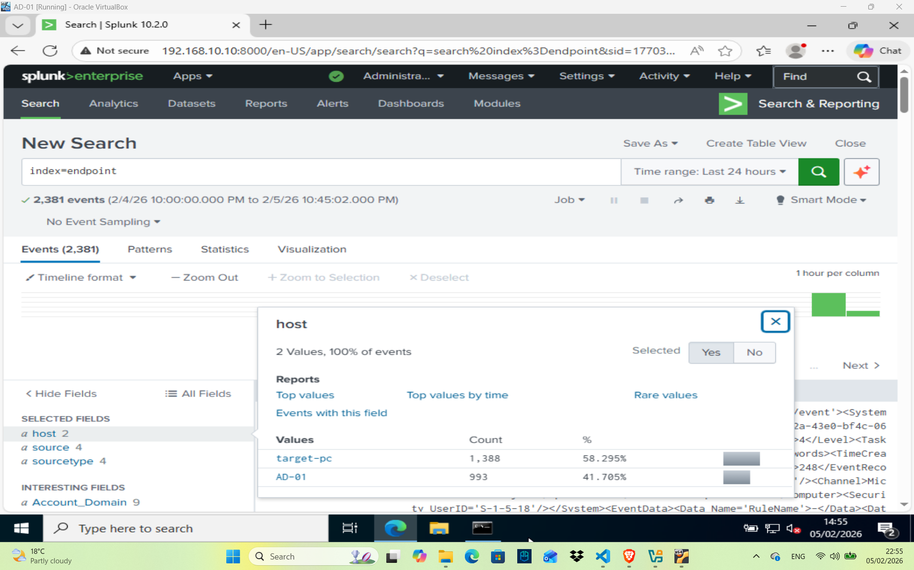

# Phase 2 – Splunk SIEM Installation

This phase covers the installation and initial configuration of Splunk Enterprise on the Ubuntu Desktop. Splunk will be used as the central SIEM to collect, analyze, and visualize logs generated from the Active Directory environment.

## Objectives
- Install Splunk Enterprise on Ubuntu Desktop
- Verify Splunk Web interface access
- Prepare Splunk to receive logs from Windows systems

## System Information
- **OS:** Ubuntu Desktop 22.04
- **Splunk Version:** Splunk Enterprise (Free)
- **Role:** SIEM / Log Aggregation
- **IP Address:** 192.168.10.10/24

## Installation Summary
- Splunk Enterprise installed successfully
- Splunk service enabled and running
- Web interface accessible on port `8000`

## Initial Validation
- Splunk Web GUI is accessible from browser
- Splunk system status shows all services running

## Windows Forwarders and Sysmon

- Splunk Universal Forwarder installed on Windows 10 (target-pc) and Windows Server 2022 (AD-01)
- Sysmon installed on both hosts to capture detailed events
- Logs successfully forwarded to Splunk (see screenshot below)

## Notes
- Splunk is actively receiving logs from Windows endpoints
- Additional detections and dashboards will be created in later phases

